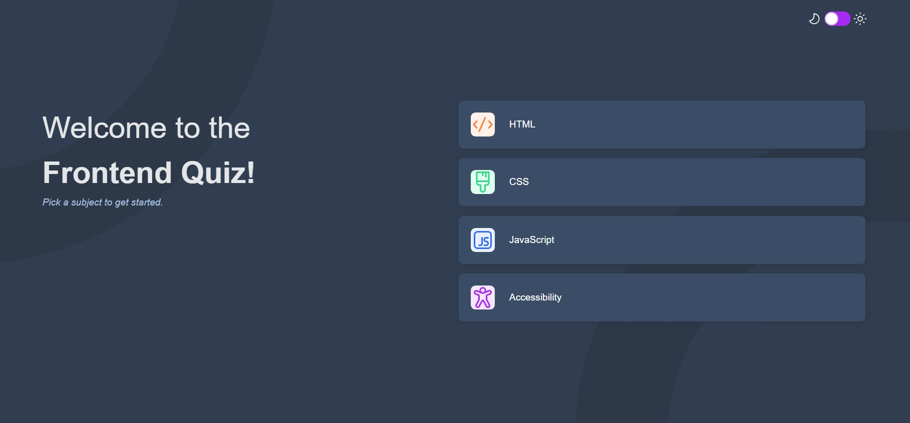

# QuizFrontier

QuizFrontier is an interactive frontend quiz app built with React and Vite. It challenges users to test their knowledge in various frontend development topics through engaging quizzes. The app provides a seamless user experience with features like subject selection, multiple-choice questions, instant feedback, score tracking, and accessibility features including voice commands.

## Table of Contents

- [Overview](#overview)
  - [Features](#features)
  - [Screenshot](#screenshot)
  - [Links](#links)
- [Installation](#installation)
- [Usage](#usage)
- [Technologies Used](#technologies-used)
- [Project Structure](#project-structure)
- [Development Process](#development-process)
  - [Challenges Faced](#challenges-faced)
  - [Lessons Learned](#lessons-learned)
- [Future Enhancements](#future-enhancements)
- [Contributing](#contributing)
- [License](#license)
- [Contact](#contact)
- [Acknowledgments](#acknowledgments)

## Overview

### Features

- Select a quiz subject from a variety of frontend development topics
- Answer multiple-choice questions and receive instant feedback on correctness
- Track your score and progress throughout the quiz
- Responsive design for optimal viewing experience on different devices
- Keyboard navigation support for enhanced accessibility
- Error handling for incomplete answer submissions
- Randomized question order for a dynamic quiz experience
- Play again option to retry the quiz with a different subject
- Dark mode toggle for comfortable viewing in different lighting conditions
- Voice command feature for enhanced accessibility
- Progress bar to visualize quiz completion status

### Screenshot

### Links

- Live Demo: [QuizFrontier Live Demo](https://quizfrontier-by-ayisha.vercel.app/)
- Repository: [QuizFrontier Repository](https://github.com/ayish1998/Frontend-quiz-app)

## Installation

1. Clone the repository:
   https://github.com/ayish1998/Frontend-quiz-app
2. Navigate to the project directory:
   cd QuizFrontier
3. Install the dependencies:
   npm install

## Usage

1. Start the development server:
   npm run dev
2. Open your browser and visit `http://localhost:5173` to access QuizFrontier.

3. Select a quiz subject from the available options.

4. Answer each question by selecting one of the four choices.

5. Submit your answer and receive instant feedback on its correctness.

6. Move on to the next question until you complete the quiz.

7. View your final score and the option to play again with a different subject.
8. Toggle dark mode for a different visual experience.
9. Use the voice command feature by clicking the speaker icon to enable/disable voice feedback.

## Technologies Used

- React: JavaScript library for building user interfaces
- Vite: Fast build tool and development server
- HTML: Markup language for structuring the app
- CSS: Stylesheet language for designing the app
- JavaScript: Programming language for app interactivity
- ESLint: Linting tool for maintaining code quality
- Web Speech API: For implementing voice command features

## Project Structure

QuizFrontier/
├── public/
│ └── index.html
├── src/
│ ├── assets/
│ │ ├── fonts/
│ │ └── images/
│ ├── components/
│ │ ├── Question.jsx
│ │ └── Quiz.jsx
│ ├── App.jsx
│ ├── index.css
│ └── main.jsx
├── .eslintrc.json
├── .gitignore
├── package.json
├── README.md
└── vite.config.js

## Development Process

### Challenges Faced

During the development of QuizFrontier, I encountered a few challenges:

1. Implementing the logic for handling question submissions and tracking scores.
2. Ensuring the app's responsiveness across different screen sizes.
3. Integrating keyboard navigation for improved accessibility.
4. Implementing the dark mode toggle feature with smooth transitions.
5. Integrating the Web Speech API for voice commands and ensuring cross-browser compatibility.
6. Balancing the UI design to accommodate new features without cluttering the interface.

### Lessons Learned

Through the development process, I learned valuable lessons:

1. Breaking down complex functionality into smaller, manageable components.
2. Utilizing React hooks and state management for efficient data handling.
3. Applying responsive design techniques to create a mobile-friendly experience.
4. Incorporating accessibility best practices to make the app inclusive.
5. Implementing accessibility features like voice commands to make the app more inclusive.
6. Managing state for features like dark mode and voice commands across components.
7. Optimizing performance when adding new features to maintain a smooth user experience.

## Future Enhancements

Some potential future enhancements for QuizFrontier include:

1. Adding a timer for each question to create a sense of urgency.
2. Implementing user authentication and personalized quiz tracking.
3. Expanding the range of quiz subjects to cover more frontend development topics.
4. Providing detailed explanations for each question after the quiz completion.
5. Implementing more advanced voice command features, such as voice input for answers.
6. Adding multi-language support for both text and voice features.
7. Creating a leaderboard system to encourage competition among users.
8. Implementing data visualization for quiz results and user progress over time.

## Contributing

Contributions are welcome! If you'd like to contribute to QuizFrontier, please follow these steps:

1. Fork the repository.
2. Create a new branch for your feature or bug fix.
3. Make your changes and commit them with descriptive messages.
4. Push your changes to your forked repository.
5. Submit a pull request detailing your changes.

Please ensure that your code adheres to the project's coding conventions and passes the linting checks.

## License

This project is licensed under Frontend Mentor [https://www.frontendmentor.io/].

## Contact

If you have any questions, suggestions, or feedback, please feel free to contact me:

- Email: laariyasaeed@gmail.com
- X: [@ayishatu_saeed](https://x.com/ayishatu_saeed)
- LinkedIn: [Ayishatu Saeed](https://www.linkedin.com/in/ayishatu-saeed-6b942a200/)

## Acknowledgments

I would like to express my gratitude to the following resources and individuals:

- [Frontend Mentor](https://www.frontendmentor.io/) for providing the project challenge and design assets.
- [React Documentation](https://reactjs.org/) for the comprehensive guides and examples.
- [Vite Documentation](https://vitejs.dev/) for the detailed instructions on configuring and building the project.
- The open-source community for their invaluable contributions and inspiration.
- [Web Speech API Documentation](https://developer.mozilla.org/en-US/docs/Web/API/Web_Speech_API) for guidance on implementing voice features.
- [CSS-Tricks](https://css-tricks.com/) for helpful articles on implementing dark mode and other CSS challenges.

Thank you for your interest in QuizFrontier! Happy quizzing!
